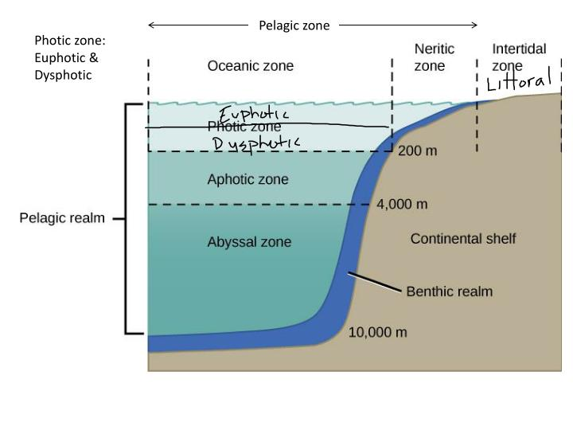
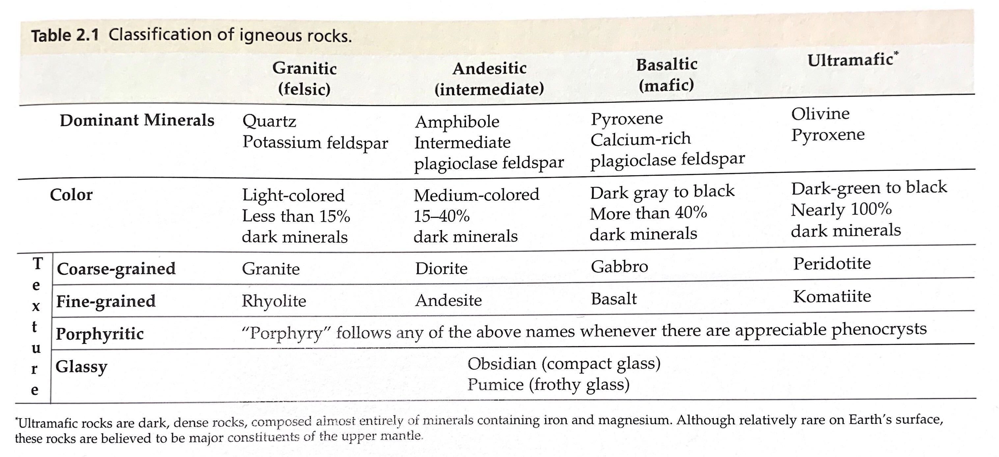

# SB - 09/08/2020

### Southern Oscillation Index

The measure of the intensity or strength of the Walker Circulation. It is one of the key atmospheric indices for gauging the strength of El Niño and La Niña events and their potential impacts on the Australian region. It's based on the **observed sea level pressure differences between Tahiti and Darwin, Australia.**

### Metacarpal vs. Metatarsal

Carpal = hand

Tarsal = foot

### Ocean Zones

### Snellen Chart

\*not discussed but it came to mind\*

an eye chart

### Tissue Striations

### Magnetic Force on a Current-Carrying Wire



### Igneous Rock Classification

